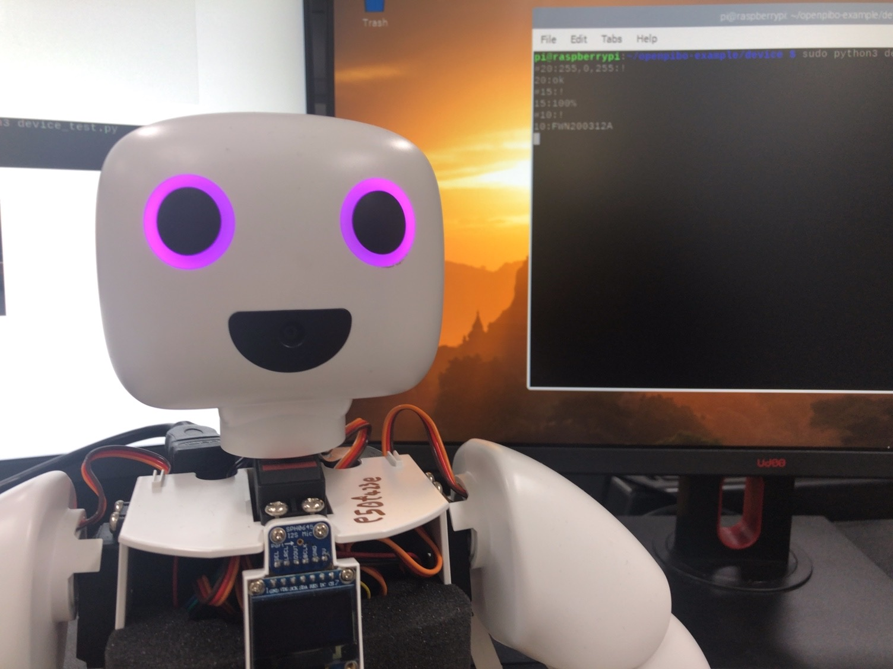
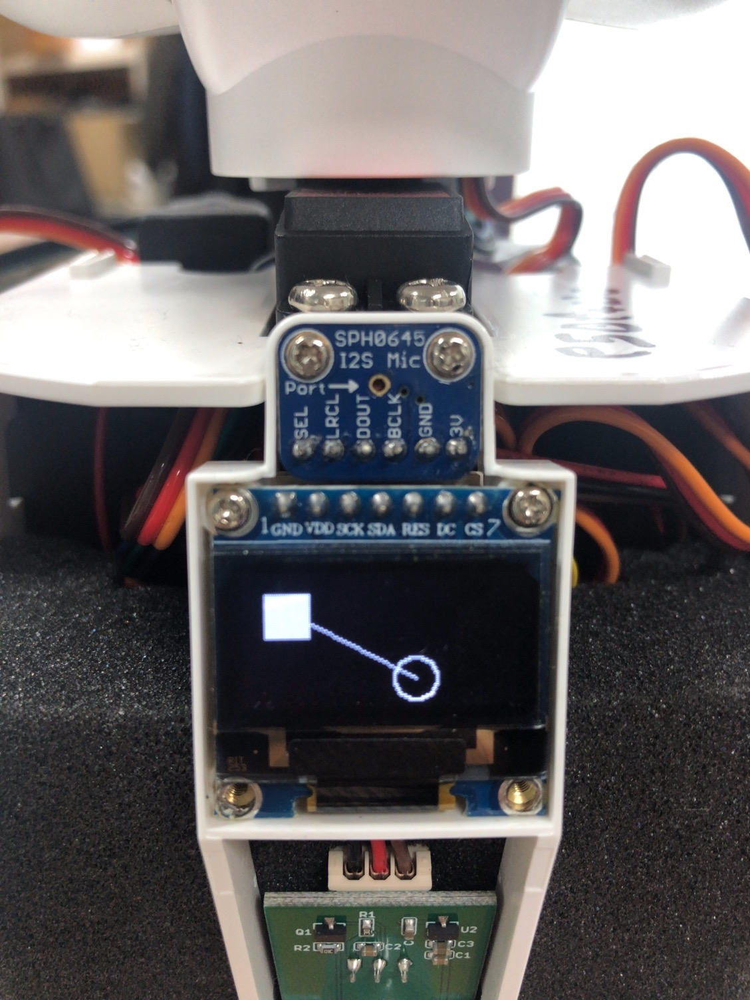
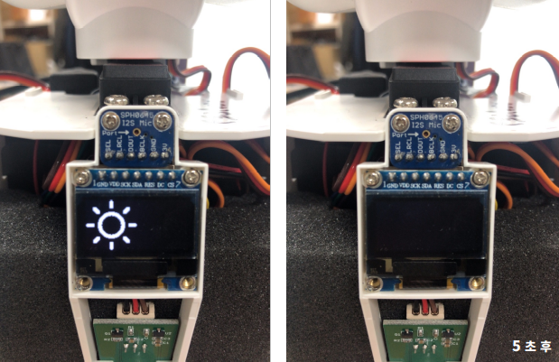
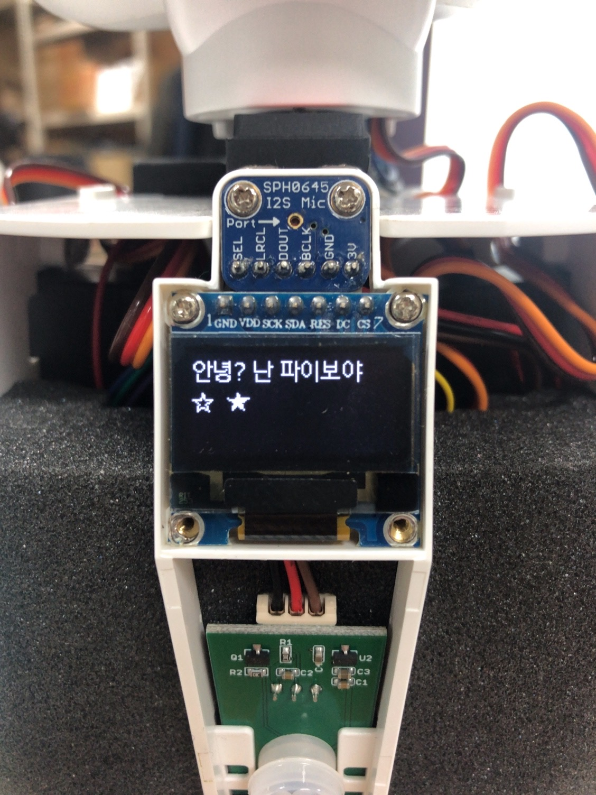
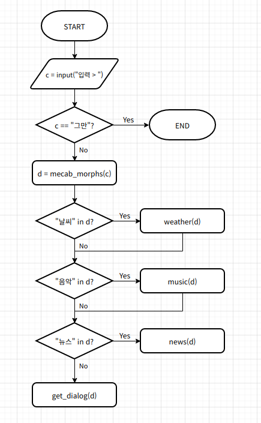
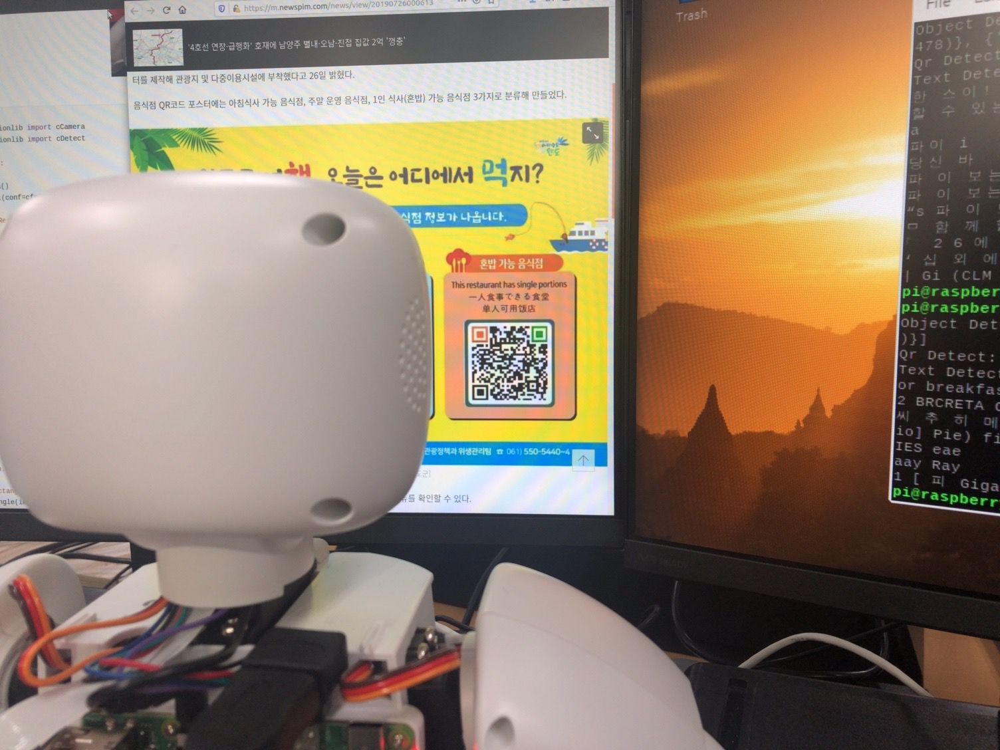
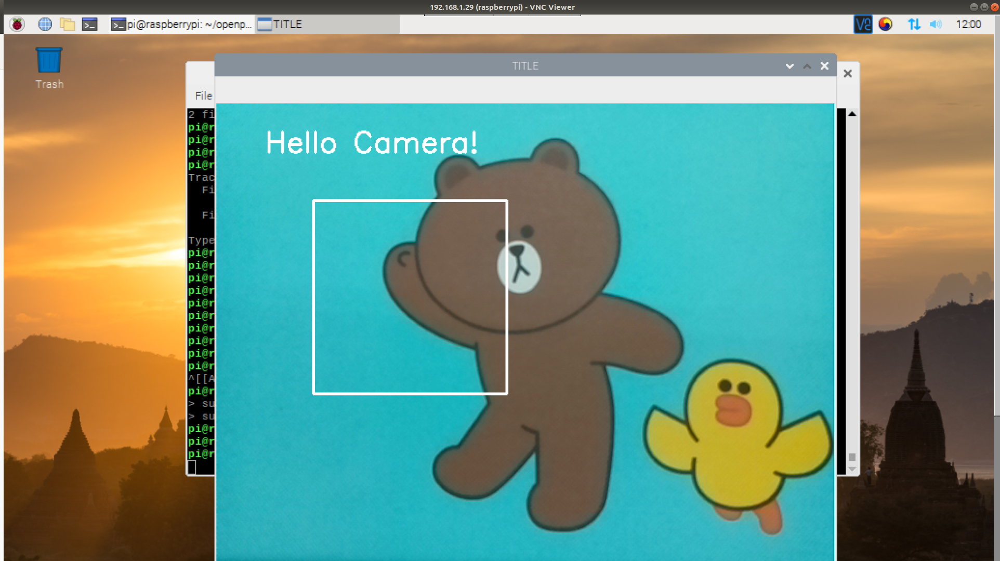
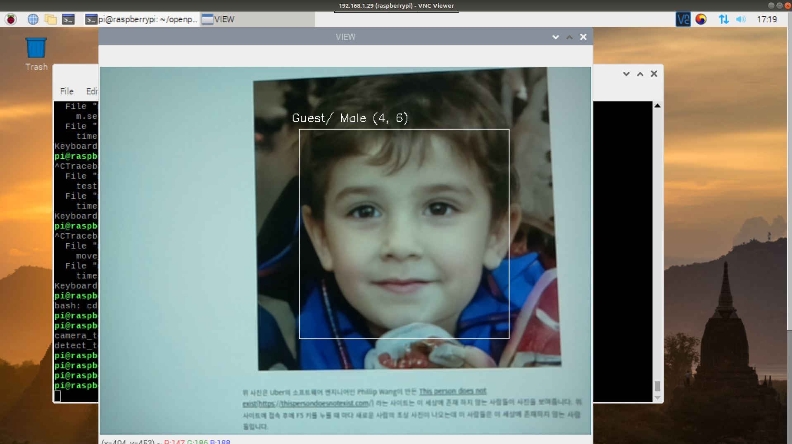

# openpibo-example


## 예제 파일 실행


다음의 코드를 입력하여 예제 파일을 실행할 수 있습니다.

```shell
~ $ git clone https://github.com/themakerrobot/openpibo-examples.git
~ $ cd openpibo-examples/{폴더명}
~/openpibo-examples/{폴더명} $ sudo python3 {파일명}
```

아래는 audio 폴더 내에 있는 play_test.py를 실행하는 예제 코드입니다.

```shell
~ $ cd openpibo-examples/audio
~/openpibo-examples/audio $ sudo python3 play_test.py
```

## 사전 학습

> 예제 파일에 공통으로 들어가는 코드 및 x-openpibo 라이브러리에 정의되어 있는 함수 사용에 관한 설명입니다.

- **import**

  openpibo의 lib를 import하여 구현합니다. `from openpibo.{module} import {class}`

  아래는 openpibo에 있는 audio의 Audio 클래스를 import하는 예제입니다.

  ```python
  # openpibo-examples/audio/play_test.py
  
  from openpibo.audio import audio

  # openpibo 라이브러리 경로 추가
  import openpibo
  ```

- **함수**

  클래스를 사용하려면 인스턴스를 생성해야 하며, 인스턴스를 통해 해당 클래스의 함수를 호출할 수 있습니다.

  아래는 Audio 클래스의 함수를 호출하여 test.mp3 파일을 재생하는 코드입니다.

  ```python
  # openpibo-examples/audio/play_test.py
  from openpibo.audio import Audio
  import openpibo

  def tts_f():
    obj = Audio()  # 인스턴스 생성, obj는 Audio 클래스의 인스턴스
    obj.play(filename=openpibo.config['DATA_PATH']+"audio/test.mp3", out='local', volume=-2000) # '인스턴스.메서드'로 Audio 클래스의 play 호출
    time.sleep(5)
    obj.stop()

  if __name__ == "__main__":
    tts_f()
  ```

- **함수의 호출** 

  1. 함수 호출 시, 해당 함수가 요구하는 매개변수(parameter)를 같이 넘겨줘야 합니다.

  2. `out='local'`, `volume='-2000'`처럼 기본 인자 값이 설정되어 있는 경우, 인자(argument)를 넘겨주지 않아도 함수 호출이 가능합니다. 

     (호출 시 인자가 없으면 기본 인자 값이 활용됨)

  3. 함수는 기본적으로 인자를 위치로 판단합니다.

  4. 키워드 인자로 전달시 순서가 바뀌어도 함수 호출이 가능합니다.

  아래는 Audio 클래스 및 함수 호출 예제 코드입니다.

  ```python
  # x-openpibo/openpibo/audio.py
  
  import os
  
  class Audio:
      def play(self, filename, out='local', volume='-2000'):
          os.system("omxplayer -o {} --vol {} {} &".format(out, volume, filename))
      def stop(self):
          os.system('sudo pkill omxplayer')
  ```

  ```python
  # play 함수 호출
  obj.play(filename=openpibo.config['DATA_PATH']+"audio/test.mp3", out='local', volume=-2000) # 방법1
  obj.play(filename=openpibo.config['DATA_PATH']+"audio/test.mp3") # 방법2 (local, volume 기본 인자값이 있으므로 가능)
  obj.play(openpibo.config['DATA_PATH']+"audio/test.mp3", 'local', -2000) # 방법3 (인자의 순서가 맞기 때문에 변수명 안써도 가능)
  obj.play(out='local', volume=-2000, openpibo.config['DATA_PATH']+"audio/test.mp3") # 방법4 (키워드 인자의 경우 순서가 바뀌어도 가능)
  ```

  단, 아래와 같이 키워드 인자를 활용한 뒤에 위치 인자를 활용할 수는 없습니다.

  ```python
  obj.play(openpibo.config['DATA_PATH']+"audio/test.mp3", 'local', -2000)  (X)
  ```

- `if __name__ == "__main__"`

  - `__name__`: 현재 모듈의 이름을 담고 있는 내장 변수입니다.
  - 해당 프로그램을 직접 실행했을 경우, 참이 되어 main 함수를 실행합니다.
  - 다른 프로그램에서 import하여 사용할 경우, main 함수는 실행하지 않습니다.


# Audio

## play_test.py

> mp3 파일을 재생 및 정지합니다.

```python
import time

import openpibo
from openpibo.audio import Audio

# test.mp3 파일 5초 재생 후 정지
def tts_f():
  obj = Audio()
  obj.play(filename=openpibo.config['DATA_PATH']+"audio/test.mp3", out='local', volume=-2000)
  time.sleep(5) # 5초동안 프로세스 정지
  obj.stop()

if __name__ == "__main__":
  tts_f()

```

**play_test.py 실행**

```shell
pi@raspberrypi:~/openpibo-example/audio $ sudo python3 play_test.py
```

# Collect

## collect_test.py

> 각종 데이터를 수집해옵니다.

```python
from openpibo.collect import *

# 위키피디아 스크래핑
wiki = Wikipedia()
wiki.search('강아지')
print(wiki) # 강아지에 대한 설명 출력

# 날씨 데이터 가져오기
weather = Weather()
weather.search('서울')
print(weather) # 서울 날씨 출력

# 뉴스 가져오기
news = News()
news.search('경제')
print(news) # 경제 뉴스 출력
```

**collect_test.py 실행**

```shell
pi@raspberrypi:~/openpibo-examples/collect $ sudo python3 collect_test.py
```

# Device

## device_once_test.py

> 인자값으로 명령어를 입력하여 파이보를 제어합니다. 

```python
from openpibo.device import Device

import argparse

def main(args):
  obj = Device()
  print('Send:', args.command)        # 실행한 명령어 출력
  data = obj.send_raw(args.command)   # Device에 메시지 전송하고 응답받음
  print('Receive:', data)             # Device로부터 받은 응답 출력

if __name__ == "__main__":
  parser = argparse.ArgumentParser()  # 인자값을 받을 수 있는 인스턴스 생성
  parser.add_argument('--command', help='check specific decvice', required=True) # default=0, 입력받고자 하는 인자의 조건 설정
  args = parser.parse_args()          # 명령창(터미널)에 주어진 인자를 파싱하여 args에 저장
  main(args)                          # 입력받은 인자값을 인수로 main 함수 실행

```

**device_once_test.py 실행**

아래는 PIBO의 양쪽 눈 색깔을 변경(24)하는 명령어 입력 코드입니다.

```shell
pi@raspberrypi:~/openpibo-examples/device $ sudo python3 device_once_test.py --command "#24:255,0,0,0,0,255:!"
```

**device_once_test.py 결과**

```shell
Send: #24:255,0,0,0,0,255:!
Receive: 24:oK
```


## device_test.py

> 명령어를 입력하여 파이보를 제어합니다. 

```python
from openpibo.device import Device

if __name__ == "__main__":
  obj = Device()
  data = obj.send_cmd(obj.code['PIR'], "on")

  # q를 입력할 때까지 계속해서 명령어 입력 가능
  while True:
    pkt = input("")
    
    if pkt == 'q':
      break
    ret = obj.send_raw(pkt)
    print(ret)
```

**device_test.py 실행**

```shell
pi@raspberrypi:~/openpibo-examples/device $ sudo python3 device_test.py
```

**device_test.py 결과**

아래는 PIBO의 눈 색깔을 변경(20), 배터리 체크(15), 버전 확인(10) 명령어를 입력했을 때의 결과입니다.

```shell
#20:255,0,255:!
20:ok
#15:!
15:100%
#10:!
10:FWN200312A
q
```



## device_test_with_thread.py

> thread를 사용하여 코드를 병렬 수행합니다.

- 파이썬은 기본적으로 Single Thread에서 순차적으로 코드를 실행합니다.

  따라서, 코드 실행 중 Blocking Function(ex. input)을 만나면 그 함수의 실행이 끝날 때까지 대기합니다.

   이때 threading 모듈을 이용한 multi thread를 사용하면 코드의 병렬 실행이 가능합니다. 

- thread: 프로세스 내에서 실제로 작업을 수행하는 주체, 프로그램(프로세스) 실행 단위 
- daemon thread
  - 메인 스레드가 종료될 때 자신의 실행 상태와 상관없이 종료되는 서브 스레드
  - daemon 속성을 True로 변경하여 사용 (default: False)
  - start()가 호출되기 전에 설정

```python
from openpibo.device import Device

import time
from threading import Thread, Lock
from queue import Queue

obj = Device()
que = Queue()

def decode_pkt(pkt):
  print("Recv:", pkt)

def update():
  # 현재 timestamp 얻기
  system_check_time = time.time()
  battery_check_time = time.time()

  while True:
    # que에 pkt가 존재하면 pkt를 제거하고 반환하여 Device에 메시지 전송 & decode_pkt 실행
    if que.qsize() > 0:
      data = obj.send_raw(que.get())
      decode_pkt(data)

    if time.time() - system_check_time > 1:  # 시스템 메시지 1초 간격 전송
      data = obj.send_cmd(obj.code['SYSTEM'])
      decode_pkt(data)
      system_check_time = time.time()

    if time.time() - battery_check_time > 10: # 배터리 메시지 10초 간격 전송
      data = obj.send_cmd(obj.code['BATTERY'])
      decode_pkt(data)
      battery_check_time = time.time()

    time.sleep(0.01)

if __name__ == "__main__":
  obj.send_cmd(obj.code['PIR'], "on")

  t = Thread(target=update, args=())
  t.daemon = True # main thread 종료시 update 메서드 종료
  t.start()       # update 메서드 실행

  # main thread  
  # 사용자가 q를 입력할 때까지 무한 반복, que에 pkt 삽입
  while True:
    pkt = input("")
    if pkt == 'q':
      break

    que.put(pkt)
```

 

**device_test_with_thread.py 실행**

```shell
pi@raspberrypi:~/openpibo-examples/device $ sudo python3 device_test_with_thread.py 
```

**device_test_with_thread.py 결과**

```shell
Recv: 40:-----
Recv: 40:-----
Recv: 40:-----
Recv: 40:person-----
Recv: 40:person-----
Recv: 40:person-----
Recv: 40:person-----
Recv: 40:person-----
Recv: 40:person-----
Recv: 15:100%
Recv: 40:person-----
Recv: 40:nobody-----
Recv: 40:-----
Recv: 40:-----
Recv: 40:-----
Recv: 40:-----
Recv: 40:-----
Recv: 40:person-----
Recv: 40:person-----
Recv: 40:person-----
Recv: 15:100%
Recv: 40:person-----
Recv: 40:person-----
Recv: 40:person-----
q
```

- 1초마다 PIR Sensor의 값 전송, 10초 간격으로 배터리 메시지 전송
- q 입력시 메인 스레드가 종료되므로 update 메서드 종료


# Motion

## motion_test.py

```python
from openpibo.motion import Motion

# wave3 모션 10번 반복
if __name__ == "__main__":
  m = Motion()
  m.set_motion(name="wave3", cycle=10)
```

아래는 motion_db.json의 일부입니다. motion_db는 `Motion.get_motion(name=None)` 함수로 확인할 수 있습니다.

```
{
  ...
  "wave3": {
    "comment":"wave",
    "init_def":1,
    "init":[0,0,0,-25,0,0,0,0,0,25],
    "pos":[
      { "d": [   0,   0,   0,  25,   0,   0,  20,   0,   0,  25 ] , "seq": 450 },
      { "d": [ -20, 999, 999, 999, 999, 999, 999, 999, 999, -25 ] , "seq": 900 },
      { "d": [ 999, 999, 999, -25,  20, 999,   0, 999, 999, 999 ] , "seq": 1350 },
      { "d": [   0, 999, 999, 999, 999, 999, 999, 999, 999,  25 ] , "seq": 1800 },
      { "d": [ -20, 999, 999, 999, 999, 999,   0, 999, 999, -25 ] , "seq": 2250 },
      { "d": [ 999, 999, 999,  25, 999, 999,  20, 999, 999, 999 ] , "seq": 2700 },
      { "d": [   0, 999, 999, 999, -20, 999, 999, 999, 999,  25 ] , "seq": 3150 },
      { "d": [ 999, 999, 999, -25, 999, 999,   0, 999, 999, 999 ] , "seq": 3600 }
    ]
  },
  ...
}
```

**motion_test.py 실행**

```shell
pi@raspberrypi:~/openpibo-examples/motion $ sudo python3 motion_test.py
```

## motor_test.py

```python
from openpibo.motion import Motion

import time

m = Motion()

def move(n, degree, speed, accel):
  m.set_speed(n, speed)         # n번 모터의 속도를 speed로 변경
  m.set_acceleration(n, accel)  # n번 모터의 가속도를 accel로 변경
  m.set_motor(n, degree)        # n번 모터의 위치를 degree로 이동

# 'move() 실행 -> 1초 휴식 -> move() 실행 -> 1초 휴식'을 무한 반복
def test():
  while True:
    move(2, 30, 100, 10)
    move(8, 30,  10, 10)
    time.sleep(1)               # 단위: 초(sec)

    move(2, -30, 100, 10)
    move(8, -30,  10, 10)
    time.sleep(1)

if __name__ == "__main__":
  test()
```

**motor_test.py 실행**

```shell
pi@raspberrypi:~/openpibo-examples/motion $ sudo python3 motor_test.py 
```

## multi_motor_test.py

```python
from openpibo.motion import Motion

import time

# 'set_motors() 실행 -> 1.1초 휴식 -> set_motors() 실행 -> 1.1초 휴식'을 무한 반복
def move_test():
  m = Motion()

  while True:
    m.set_motors(positions=[0,0,30,20, 30,0, 0,0,30,20], movetime=1000)
    time.sleep(1.1)
    m.set_motors(positions=[0,0,-30,-20, -30,0, 0,0,-30,-20], movetime=1000)
    time.sleep(1.1)

if __name__ == "__main__":
  move_test()
```

**multi_motor_test.py 실행**

```shell
pi@raspberrypi:~/openpibo-examples/motion $ sudo python3 multi_motor_test.py
```

## pymotor_test.py

```python
from openpibo.motion import PyMotion

import time

m = PyMotion()

def move(n, speed, accel, degree):
  m.set_speed(n, speed)
  m.set_acceleration(n, accel)
  m.set_motor(n, degree)

# 2초 간격으로 move() 실행 무한 반복
def test():
  while True:
    move(2, 50, 0, 30)
    time.sleep(2)

    move(2, 50, 10, -30)
    time.sleep(2)

# Init 출력 -> move() -> 1초  휴식 -> Start 출력 -> test()
if __name__ == "__main__":
  print("Init")
  move(2, 20, 0, 0)
  time.sleep(1)

  print("Start")
  test()
```

**pymotor_test.py 실행**

```shell
pi@raspberrypi:~/openpibo-examples/motion $ sudo python3 pymotor_test.py
```

**pymotor_test.py 결과**

```shell
Init
Start
```

# OLED

## figure_test.py

> OLED display에 도형과 선을 출력합니다.

```python
from openpibo.oled import Oled

def oled_f():
  oObj = Oled()
  oObj.clear()                              # 화면 지우기
  oObj.draw_rectangle((10,10,30,30) ,True)  # 길이가 20인 채워진 사각형 그리기
  oObj.draw_ellipse((70,40,90,60) ,False)   # 지름이 20인 빈 원 그리기
  oObj.draw_line((15,15,80,50))             # 선 그리기
  oObj.show()                               # 화면에 표시

if __name__ == "__main__":
  oled_f()
```

**figure_test.py 실행**

```shell
pi@raspberrypi:~/openpibo-examples/oled $ sudo python3 figure_test.py
```

**figure_test.py 결과**



## image_test.py

> OLED display에 이미지를 출력합니다. (128X64만 가능합니다.)

```python
import openpibo
from openpibo.oled import Oled

import time

# 화면에 clear.png 이미지 5초간 표시
def oled_f():
  oObj = Oled()
  oObj.draw_image(openpibo.config['DATA_PATH']+".images/clear.png")  # clear.png 그리기
  oObj.show()   # 화면에 표시
  time.sleep(5) # 5초동안 프로세스 정지
  oObj.clear()  # 화면 지우기
  oObj.show()

if __name__ == "__main__":
  oled_f()
```

**image_test.py 실행**

```shell
pi@raspberrypi:~/openpibo-examples/oled $ sudo python3 image_test.py
```

**image_test.py 결과**



## self_test.py

> 직접 실습해보세요.

```python
from openpibo.oled import Oled

def oled_f():
  print('my oled design')


if __name__ == "__main__":
  oled_f()
```

**self_test.py 실행**

```shell
pi@raspberrypi:~/openpibo-examples/oled $ sudo python3 self_test.py
```

## text_test.py

> OLED display에 문자열을 출력합니다.

```python
from openpibo.oled import Oled

# (0,0), (0,20)에 15 크기의 text 표시
def oled_f():
  oObj = Oled()
  oObj.set_font(size=15)
  
oObj.draw_text((0, 0), "안녕? 난 파이보야 ")  # (0,0)에 문자열 출력
  oObj.draw_text((0,20), "☆  ★ ") # (0,20)에 문자열 출력
  oObj.show() # 화면에 표시

'''
  for count in range(5):
    oObj.clear()
    oObj.draw_text((10,10), "Hello World:{}".format(count))
    oObj.show()
    time.sleep(1)

  oObj.clear()
'''

if __name__ == "__main__":
  oled_f()
```

**text_test.py 실행**

```shell
pi@raspberrypi:~/openpibo-examples/oled $ sudo python3 text_test.py
```

**text_test.py 결과**



# Speech

## chatbot_test.py

> 입력한 문장에 대해 형태소 분석을 실시하여 파이보와 대화를 시작합니다.
>
> 사용자가 입력한 문장에 db의 key 값(날씨, 음악, 뉴스)이 있으면 해당 함수를 실행하고, 없다면 대화봇을 실행합니다.

```python
from openpibo.speech import Dialog

def weather(cmd):
  lst, _type = ["오늘", "내일"], None

  # 분석한 문장 중 "오늘", "내일"이 있다면 _type=item으로 설정
  for item in lst:
    if item in cmd:
      _type = item

  if _type == None:
    print("BOT > 오늘, 내일 날씨만 가능해요. ")
  else:
    print("BOT > {} 뉴스 알려줄게요.".format(_type))


def music(cmd):
  lst, _type = ["발라드", "댄스", "락"], None

  # 분석한 문장 중 "발라드", "댄스", "락"이 있다면 _type=item으로 설정
  for item in lst:
    if item in cmd:
      _type = item

  if _type == None:
    print("BOT > 발라드, 락, 댄스 음악만 가능해요.")
  else:
    print("BOT > {} 음악 틀어줄게요.".format(_type))

def news(cmd):
  lst, _type = ["경제", "스포츠", "문화"], None

  # 분석한 문장 중 "경제", "스포츠", "문화"가 있다면 _type=item으로 설정
  for item in lst:
    if item in cmd:
      _type = item

  if _type == None:
    print("BOT > 경제, 문화, 스포츠 뉴스만 가능해요.")
  else:
    print("BOT > {} 뉴스 알려줄게요.".format(_type))

db = {
  "날씨":weather,
  "음악":music, 
  "뉴스":news,
}

# 사용자가 입력한 문장에 대해 형태소 분석을 실시하여 파이보가 실행하는 함수가 달라짐
def main():
  obj = Dialog()
  print("대화 시작합니다.")
  while True:
    c = input("입력 > ")
    matched = False
    if c == "그만":
      break

    # 사용자가 입력한 질문에 대한 형태소 분석
    d = obj.mecab_morphs(c)
    # print("형태소 분석: ", d)
    # 분석한 문장 중 "날씨", "음악", "뉴스"가 있다면 해당 key값의 함수 실행
    for key in db.keys():
      if key in d:
        db[key](d)
        matched = True

    # key 값이 없다면 대화봇 실행
    if matched == False:
      print("대화봇 > ", obj.get_dialog(c))

if __name__ == "__main__":
  main()
```



**chatbot_test.py 실행**

```shell
pi@raspberrypi:~/openpibo-examples/speech $ sudo python3 chatbot_test.py 
```

**chatbot_test.py 결과**

```shell
대화 시작합니다.
입력 > 댄스 음악 추천해줘
BOT > 댄스 음악 틀어줄게요.
입력 > 주말에 뭐하지
대화봇 >  사탕 만들어요.
입력 > 사탕 싫어
대화봇 >  싫어하지 말아요.
입력 > 그만
```

## mecab_test.py

> 사용자가 입력한 문장을 분석합니다. 3가지 모드 선택이 가능합니다.

```python
from openpibo.speech import Dialog

# mode(pos, morphs, nouns)에 따른 문장 분석
def mecab_f(string, mode):
  print("Input: ", string)
  obj = Dialog()
  
  if mode == "pos":
    data = obj.mecab_pos(string)
  elif mode == "morphs":
    data = obj.mecab_morphs(string)
  elif mode == "nouns":
    data = obj.mecab_nouns(string)
  print("Output: ", data)

if __name__ == "__main__":
  mecab_f("아버지 가방에 들어가신다", "nouns")
```

**mecab_test.py 실행**

```shell
pi@raspberrypi:~/openpibo-examples/speech $ sudo python3 mecab_test.py
```

**mecab_test.py 결과**

```shell
Input:  아버지 가방에 들어가신다
Output:  ['아버지', '가방']

# (+) pos 결과
Input:  아버지 가방에 들어가신다
Output:  [('아버지', 'NNG'), ('가방', 'NNG'), ('에', 'JKB'), ('들어가', 'VV'), ('신다', 'EP+EC')]

# (+) morphs 결과
Input:  아버지 가방에 들어가신다
Output:  ['아버지', '가방', '에', '들어가', '신다']
```

- NNG: 일반 명사 / JKB: 부사격 조사 / VV: 동사 / EP: 선어말 어미 / EC: 연결 어미

  ( 품사 태그표: [https://docs.google.com/spreadsheets/d/1OGAjUvalBuX-oZvZ_-9tEfYD2gQe7hTGsgUpiiBSXI8/edit#gid=0](https://docs.google.com/spreadsheets/d/1OGAjUvalBuX-oZvZ_-9tEfYD2gQe7hTGsgUpiiBSXI8/edit#gid=0))

## stt_test.py

```python
from openpibo.speech import Speech

obj = Speech()
# 음성 언어를 문자 데이터로 변환하여 출력
ret = obj.stt()
print(ret)
```

**stt_test.py 실행**

```shell
pi@raspberrypi:~/openpibo-examples/speech $ sudo python3 stt_test.py
```

## translate_test.py

> 문장을 번역합니다.

```python
from openpibo.speech import Speech

# "안녕하세요"를 영어로 번역 후 출력
def translate_f():
  obj = Speech()
  string = "안녕하세요"
  ret = obj.translate(string, to="en")
  print("Input:", string)
  print("Output:", ret)

if __name__ == "__main__":
  translate_f()
```

**translate_test.py 실행**

```shell
pi@raspberrypi:~/openpibo-examples/speech $ sudo python3 translate_test.py
```

**translate_test.py 결과**

```shell
Input: 안녕하세요
Output: Good morning 
```

## tts_test.py

> 문자 데이터를 음성 언어로 변환합니다.

```python
import openpibo
from openpibo.speech import Speech
from openpibo.audio import Audio

# tts.mp3 파일의 문자 데이터를 음성 언어로 변환 후, 파이보 스피커에 출력
def tts_f():
  tObj = Speech()
  filename = openpibo.config['DATA_PATH']+"audio/tts.mp3"
  tObj.tts("<speak>\
              <voice name='MAN_READ_CALM'>안녕하세요. 반갑습니다.<break time='500ms'/></voice>\
            </speak>"\
          , filename)
  print(filename)
  aObj = Audio()
  aObj.play(filename, out='local', volume=-1500)  # 파이보 스피커로 filename 출력

if __name__ == "__main__":
  tts_f()
```

- speak

  - 기본적으로 모든 음성은 태그로 감싸져야 한다.
  - 태그 하위로 `,`를 제외한 모든 태그가 존재할 수 있다.
  - 문장, 문단 단위로 적용하는 것을 원칙으로 한다. 한 문장 안에서 단어별로 태그를 감싸지 않는다.

  ```
  <speak> 안녕하세요. 반가워요. </speak>
  ```

- voice

  - 음성의 목소리를 변경하기 위해 사용하며, name attribute를 통해 원하는 목소리를 지정한다. 제공되는 목소리는 4가지이다.
    - WOMAN_READ_CALM: 여성 차분한 낭독체 (default)
    - MAN_READ_CALM: 남성 차분한 낭독체
    - WOMAN_DIALOG_BRIGHT: 여성 밝은 대화체
    - MAN_DIALOG_BRIGHT: 남성 밝은 대화체
  - 하위로 `,`를 제외한 모든 태그(kakao: effet, prosody, break, audio, say-as, sub)가 존재할 수 있다.
  - 문장, 문단 단위로 적용하는 것을 원칙으로 한다. 한 문장 안에서 단어별로 태그를 감싸지 않는다.

  ```
  <speak>
  <voice name="WOMAN_READ_CALM"> 지금은 여성 차분한 낭독체입니다.</voice>
  <voice name="MAN_READ_CALM"> 지금은 남성 차분한 낭독체입니다.</voice>
  <voice name="WOMAN_DIALOG_BRIGHT"> 안녕하세요. 여성 밝은 대화체예요.</voice>
  <voice name="MAN_DIALOG_BRIGHT"> 안녕하세요. 남성 밝은 대화체예요.</voice>
  </speak>
  ```

**tts_test.py 실행**

```shell
pi@raspberrypi:~/openpibo-examples/speech $ sudo python3 tts_test.py 
```


# Vision

- OpenCV DNN 모듈

  - 딥러닝 학습은 Caffe 프레임워크에서 진행하고, 학습된 모델을 dnn 모듈로 불러와서 실행(`cv2.dnn.readNet()`)

## camera_test.py

> 사진을 촬영하고 저장합니다.

```python
from openpibo.vision import Camera

def test_func():
  # instance
  cam = Camera()

  # Capture / Read file
  # 이미지 촬영
  img = cam.read()
  #img = cam.imread("/home/pi/test.jpg")

  # Write(test.jpg라는 이름을 촬영한 이미지 저장)
  cam.imwrite("test.jpg", img)

  # display (only GUI): 3초동안 'TITLE'이라는 제목으로 이미지 보여줌
  cam.imshow(img, "TITLE")
  cam.waitKey(3000) # 단위: ms

if __name__ == "__main__":
  test_func()
```

**camera_test.py 실행**

```shell
pi@raspberrypi:~/openpibo-examples/vision $ sudo python3 camera_test.py 
```

**camera_test.py 결과**


## detect_test.py

> 이미지의 객체/QR코드/문자를 인식합니다.

```python
from openpibo.vision import Camera
from openpibo.vision import Detect

def test_func():
  # instance
  cam = Camera()  # Camera 클래스에 대한 객체 생성
  det = Detect()

  # Capture / Read file
  img = cam.read()
  #img = cam.imread("image.jpg")

  print("Object Detect: ", det.detect_object(img))  # 객체 인식
  print("Qr Detect:", det.detect_qr(img))           # QR코드 인식
  print("Text Detect:", det.detect_text(img))       # 문자 인식

if __name__ == "__main__":
  test_func()
```

**detect_test.py 실행**

```shell
pi@raspberrypi:~/openpibo-examples/vision $ sudo python3 detect_test.py 
```

**detect_test.py 결과**

```shell
Object Detect:  [{'name': 'bus', 'score': 80.67924976348877, 'position': (2, 0, 627, 478)}]
Qr Detect: {'data': 'http://www.wando.go.kr/l04xd2@', 'type': 'QRCODE'}
Text Detect: ’
> fxr
cends, This restaurant has ungie portions
—ARBTSORE
ㅅ 피 메 엔 로
oO a |
Fs
```



## draw_test.py

> 이미지에 그림과 글씨를 입력합니다.

```python
from openpibo.vision import Camera

def test_func():
  # instance
  cam = Camera()

  # Capture / Read file
  img = cam.read()
  #img = cam.imread("/home/pi/test.jpg")

  # Draw rectangle, Text
  cam.rectangle(img, (100,100), (300,300))    # 화면의 (100,100), (300,300) 위치에 사각형 그리기
  cam.putText(img, "Hello Camera", (50, 50))  # 화면의 (50,50) Hello Camera 쓰기

  # Write
  cam.imwrite("test.jpg", img)  # test.jpg로 이미지 저장

  # display (only GUI): 3초동안 'TITLE'이라는 제목으로 이미지 보여줌
  cam.imshow(img, "TITLE")
  cam.waitKey(3000)

if __name__ == "__main__":
  test_func()
```

**draw_test.py 실행**

```shell
pi@raspberrypi:~/openpibo-example/vision $ sudo python3 draw_test.py
```

**draw_test.py 결과**



## face_recognize_test.py

> 이미지에서 얼굴을 찾아 나이와 성별을 추정합니다.

```python
from openpibo.vision import Camera
from openpibo.vision import Face

def test_f():
  # instance
  cam = Camera()
  faceObj = Face()

  # Capture / Read file
  img = cam.read()
  #img = cam.imread("/home/pi/test.jpg")
 
  disp = img.copy()

  # detect faces
  faceList = faceObj.detect(img)

  if len(faceList) < 1:
    print("No face")
    return 
 
  # get ageGender
  ret = faceObj.get_ageGender(img, faceList[0])
  age = ret["age"]
  gender = ret["gender"]

  # draw rectangle
  x,y,w,h = faceList[0]  
  cam.rectangle(disp, (x,y), (x+w, y+h))

  # recognize using facedb(동일인이라 판정되면 이름, 아니면 Guest)
  ret = faceObj.recognize(img, faceList[0])
  name = "Guest" if ret == False else ret["name"]

  cam.putText(disp, "{}/ {} {}".format(name,gender,age), (x-10, y-10), size=0.5)

  # display (only GUI): 모니터에서 3초간 VIEW라는 제목으로 이미지 확인
  cam.imshow(disp, "VIEW")
  cam.waitKey(3000)

  # Write: test.jpg로 이미지 저장
  cam.imwrite("test.jpg", disp)

if __name__ == "__main__":
  test_f()
```

**face_recognize_test.py 실행**

```shell
pi@raspberrypi:~/openpibo-examples/vision $ sudo python3 face_recognize_test.py 
```

**face_recognize_test.py 결과**



## face_train_test.py

> 이미지에서 얼굴을 찾아 학습하여 데이터베이스에 저장하고 로드한  뒤 다시 삭제합니다.

```python
from openpibo.vision import Camera
from openpibo.vision import Face

def test_func():
  # instance
  cam = Camera()
  faceObj = Face()

  print("Start DB:", faceObj.get_db()[0])
  
  # Capture / Read file
  img = cam.read()
  #img = cam.imread("/home/pi/test.jpg")

  # Train face
  faces = faceObj.detect(img)
  if len(faces) < 1:
    print(" No face")
  else:
    # 얼굴 학습(학습할  이미지 데이터, 얼굴 1개 위치, 학습할 얼굴 이름)
    print(" Train:", faceObj.train_face(img, faces[0], "pibo"))
  print("After Train, DB:", faceObj.get_db()[0])

  img = cam.read()
  faces = faceObj.detect(img)
  if len(faces) < 1:
    print(" No face")
  else:
    print(" Recognize:", faceObj.recognize(img, faces[0]))

  # Save DB
  faceObj.save_db("./facedb")

  # Reset DB
  faceObj.init_db()
  print("After reset db, DB:", faceObj.get_db()[0])
  
  # Load DB
  faceObj.load_db("facedb")
  print("After Load db, DB:", faceObj.get_db()[0])

  # delete Face
  faceObj.delete_face("pibo")
  print("After Delete face:", faceObj.get_db()[0])

if __name__ == "__main__":
  test_func()
```

**face_train_test.py 실행**

```shell
pi@raspberrypi:~/openpibo-examples/vision $ sudo python3 face_train_test.py
```

**face_train_test.py 결과**

```python
Start DB: []
 Train: None
After Train, DB: ['pibo']
 Recognize: {'name': 'pibo', 'score': 0.02}
After reset db, DB: []
After Load db, DB: ['pibo']
After Delete face: []
```

## streaming_test.py

> 모니터에 이미지를 스트리밍합니다.

```python
from openpibo.vision import Camera

# 모니터에 3초간 이미지 스트리밍
def test_func():
  # instance
  cam = Camera()

  # For streaming (only GUI)
  cam.streaming(timeout=3)

if __name__ == "__main__":
  test_func()
```

**streaming_test.py 실행**

```shell
pi@raspberrypi:~/openpibo-examples/vision $ sudo python3 streaming_test.py
```

**streaming_test.py 결과**


